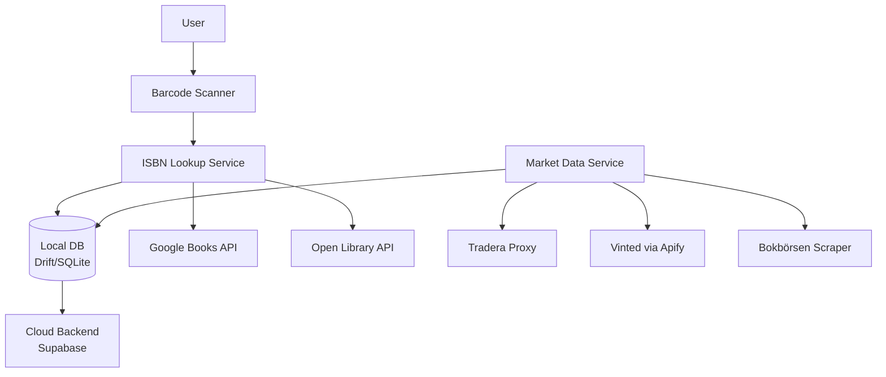

# Bokfynd Architecture Overview

**Date:** April 28, 2026  
**Source:** Extracted from BOKFYND_DEEP_ANALYSIS.md  
**Status:** Technical Architecture Design

---

## Architecture Simplification

### Complexity Reduction Analysis

| Component | LoppisFynd | Bokfynd | Reduction |
|-----------|------------|---------|-----------|
| Services | 5 (AI, Market, Sync, Privacy, Analytics) | 4 (Market, Sync, Privacy, Analytics) | -20% |
| Database Tables | 11 | 8 | -27% |
| External APIs | 3 (Tradera, Gemma, Supabase) | 5+ (Google Books, Open Library, Tradera, Vinted, Bokbörsen, Supabase) | +67% |
| Background Jobs | 2 (Market sync, Model download) | 1 (Market sync) | -50% |
| State Machine States | 7 | 5 | -29% |

**Key Insight:** While the number of external APIs increases, the complexity per API decreases dramatically. ISBN lookup is a simple HTTP GET vs. AI inference which requires isolates, model management, and complex error handling.

---

## Data Model Transformation

### Before (LoppisFynd)

```dart
ScanItems {
  id, userId, haulId,
  imagePath, thumbPath,  // ← Storage overhead
  aiJson, query, desc, confidence,  // ← AI complexity
  status (7 states),  // ← Complex state machine
  medianPrice, minPrice, maxPrice,
  ...
}
```

### After (Bokfynd)

```dart
Books {
  id, userId,
  isbn,  // ← Simple, standardized identifier
  title, author, publisher, publishYear, coverUrl,  // ← From API
  purchasePriceSek, saved,  // ← User decision
  highestSoldPriceSek, averageSoldPriceSek, lowestSoldPriceSek,
  salesPerMonth,  // ← Aggregated market data
  scannedAt, updatedAt,
}
```

**Analysis:**
- **Simpler:** No image storage, no AI fields, no complex status states
- **Cleaner:** ISBN as natural key, clear separation of metadata vs market data
- **More Maintainable:** Fewer nullable fields, clearer semantics

---

## Service Layer Comparison

### LoppisFynd Service Complexity

```
AiInferenceIsolateService
├── Spawn isolate per inference (100-500ms overhead)
├── Model installation check
├── Image preprocessing
├── JSON parsing and validation
├── Error handling (model not installed, inference failed, cancelled)
└── Cleanup (kill isolate)

Total: ~300 lines, high cyclomatic complexity
```

### Bokfynd Service Complexity

```
IsbnLookupService
├── HTTP GET to Google Books API
├── Parse JSON response
├── Fallback to Open Library
└── Cache result

Total: ~80 lines, low cyclomatic complexity
```

**Complexity Reduction: 73%**

---

## Critical Path Performance

### LoppisFynd: Scan → Result

```
1. Capture image (1-2s)
2. Save to storage (0.5s)
3. Generate thumbnail (1-2s)
4. Spawn isolate (0.2s)
5. Load model (2-5s, first time)
6. Run inference (3-10s)
7. Parse result (0.1s)
8. Fetch market data (2-5s)
---
Total: 10-30 seconds
```

### Bokfynd: Scan → Result

```
1. Scan barcode (0.5-1s)
2. Lookup ISBN (1-2s, cached or API)
3. Fetch market data (2-5s, parallel)
---
Total: 3-8 seconds
```

**Performance Improvement: 60-75% faster**

---

## System Architecture



---

## Service Layer Design

### Multi-Platform Market Data

```dart
abstract class MarketDataSource {
  Future<List<BookSale>> search(String isbn);
}

class TraderaMarketDataSource implements MarketDataSource {
  // Existing implementation via proxy
  @override
  Future<List<BookSale>> search(String isbn) async {
    // Use existing Tradera proxy
  }
}

class VintedMarketDataSource implements MarketDataSource {
  final VintedScraperService _scraper;
  
  @override
  Future<List<BookSale>> search(String isbn) async {
    return _scraper.searchVinted(isbn);
  }
}

class BokborsenMarketDataSource implements MarketDataSource {
  // TODO: Implement when validated
  @override
  Future<List<BookSale>> search(String isbn) async {
    throw UnimplementedError('Bokbörsen scraping not yet implemented');
  }
}

class AggregatedMarketDataService {
  final List<MarketDataSource> _sources;
  final AppDatabase _db;
  
  AggregatedMarketDataService({
    required List<MarketDataSource> sources,
    required AppDatabase db,
  }) : _sources = sources, _db = db;
  
  Future<BookMarketStats> fetchMarketStats(String isbn) async {
    // Check cache first
    final cached = await _db.bookMarketDataDao.getCached(isbn);
    if (cached != null && _isFresh(cached)) {
      return _calculateStats(cached);
    }
    
    // Fetch from all sources in parallel
    final results = await Future.wait(
      _sources.map((source) => source.search(isbn).catchError((_) => <BookSale>[])),
    );
    
    // Flatten and deduplicate
    final allSales = results.expand((x) => x).toList();
    final deduplicated = _deduplicateSales(allSales);
    
    // Filter outliers
    final filtered = _removeOutliers(deduplicated);
    
    // Calculate stats
    final stats = _calculateStats(filtered);
    
    // Cache results
    await _db.bookMarketDataDao.upsertBatch(isbn, filtered);
    
    return stats;
  }
  
  List<BookSale> _deduplicateSales(List<BookSale> sales) {
    // Remove duplicates based on price + date (same item listed on multiple platforms)
    final seen = <String>{};
    return sales.where((sale) {
      final key = '${sale.priceSek}_${sale.soldAt.toIso8601String()}';
      if (seen.contains(key)) return false;
      seen.add(key);
      return true;
    }).toList();
  }
  
  bool _isFresh(List<BookSale> cached) {
    if (cached.isEmpty) return false;
    final oldestFetch = cached.map((s) => s.fetchedAt).reduce((a, b) => a.isBefore(b) ? a : b);
    return DateTime.now().difference(oldestFetch) < Duration(days: 7);
  }
}
```

---

## ISBN Lookup Service

```dart
class IsbnLookupService {
  final http.Client _client;
  final AppDatabase _db;
  
  Future<BookMetadata?> lookupIsbn(String isbn) async {
    // Check cache first
    final cached = await _db.bookMetadataDao.getByIsbn(isbn);
    if (cached != null) return cached;
    
    // Try Google Books first
    try {
      final metadata = await _fetchFromGoogleBooks(isbn);
      if (metadata != null) {
        await _db.bookMetadataDao.upsert(metadata);
        return metadata;
      }
    } catch (e) {
      // Log but continue to fallback
    }
    
    // Fallback to Open Library
    try {
      final metadata = await _fetchFromOpenLibrary(isbn);
      if (metadata != null) {
        await _db.bookMetadataDao.upsert(metadata);
        return metadata;
      }
    } catch (e) {
      // Log error
    }
    
    return null;
  }
  
  Future<BookMetadata?> _fetchFromGoogleBooks(String isbn) async {
    final response = await _client.get(
      Uri.parse('https://www.googleapis.com/books/v1/volumes?q=isbn:$isbn'),
    );
    
    if (response.statusCode != 200) return null;
    
    final json = jsonDecode(response.body);
    if (json['totalItems'] == 0) return null;
    
    final item = json['items'][0];
    final volumeInfo = item['volumeInfo'];
    
    return BookMetadata(
      isbn: isbn,
      title: volumeInfo['title'],
      author: (volumeInfo['authors'] as List?)?.first,
      publisher: volumeInfo['publisher'],
      publishYear: volumeInfo['publishedDate']?.substring(0, 4),
      coverUrl: volumeInfo['imageLinks']?['thumbnail'],
    );
  }
  
  Future<BookMetadata?> _fetchFromOpenLibrary(String isbn) async {
    // Similar implementation for Open Library API
  }
}
```

---

## Database Schema

### Core Tables

**books**
- `id` (primary key)
- `user_id` (foreign key)
- `isbn` (unique, indexed)
- `title`, `author`, `publisher`, `publish_year`
- `cover_url`
- `purchase_price_sek`
- `saved` (boolean)
- `scanned_at`, `updated_at`

**book_market_data**
- `id` (primary key)
- `isbn` (foreign key to books)
- `platform` (tradera, vinted, bokborsen)
- `price_sek`
- `sold_at`
- `listing_url`
- `fetched_at`

**book_market_stats** (cached aggregates)
- `isbn` (primary key)
- `highest_sold_price_sek`
- `average_sold_price_sek`
- `lowest_sold_price_sek`
- `sales_per_month`
- `last_updated_at`

### Removed Tables (from LoppisFynd)
- `scan_items` (replaced by `books`)
- `ai_inference_results` (no longer needed)
- `scan_images` (no longer needed)

---

## Configuration

### App Config

```dart
class AppConfig {
  const AppConfig({
    required this.appEnv,
    required this.googleBooksApiKey,
    required this.traderaProxyUrl,
    required this.apifyApiToken, // NEW
    required this.supabaseUrl,
    required this.supabaseAnonKey,
    required this.sentryDsn,
  });

  final String appEnv;
  final String googleBooksApiKey;
  final String traderaProxyUrl;
  final String apifyApiToken; // NEW
  final String supabaseUrl;
  final String supabaseAnonKey;
  final String sentryDsn;

  factory AppConfig.fromEnvironment() {
    return const AppConfig(
      appEnv: String.fromEnvironment('APP_ENV', defaultValue: 'dev'),
      googleBooksApiKey: String.fromEnvironment('GOOGLE_BOOKS_API_KEY', defaultValue: ''),
      traderaProxyUrl: String.fromEnvironment('TRADERA_PROXY_URL', defaultValue: ''),
      apifyApiToken: String.fromEnvironment('APIFY_API_TOKEN', defaultValue: ''), // NEW
      supabaseUrl: String.fromEnvironment('SUPABASE_URL', defaultValue: ''),
      supabaseAnonKey: String.fromEnvironment('SUPABASE_ANON_KEY', defaultValue: ''),
      sentryDsn: String.fromEnvironment('SENTRY_DSN', defaultValue: ''),
    );
  }

  bool get hasGoogleBooksApi => googleBooksApiKey.trim().isNotEmpty;
  bool get hasTraderaProxy => traderaProxyUrl.trim().isNotEmpty;
  bool get hasApify => apifyApiToken.trim().isNotEmpty; // NEW
  bool get hasSupabase => supabaseUrl.trim().isNotEmpty && supabaseAnonKey.trim().isNotEmpty;
  bool get hasSentry => sentryDsn.trim().isNotEmpty;
}
```

---

## Provider Configuration

```dart
// In lib/core/app/providers.dart

final traderaMarketDataSourceProvider = Provider<TraderaMarketDataSource>((ref) {
  final config = ref.watch(appConfigProvider);
  return TraderaMarketDataSource(
    traderaClient: TraderaClient(functionUrl: Uri.parse(config.traderaProxyUrl)),
  );
});

final vintedMarketDataSourceProvider = Provider<VintedMarketDataSource>((ref) {
  final config = ref.watch(appConfigProvider);
  return VintedMarketDataSource(
    scraper: VintedScraperService(apifyApiToken: config.apifyApiToken),
  );
});

final aggregatedMarketDataServiceProvider = Provider<AggregatedMarketDataService>((ref) {
  final db = ref.watch(appDatabaseProvider);
  final sources = <MarketDataSource>[
    ref.watch(traderaMarketDataSourceProvider),
    ref.watch(vintedMarketDataSourceProvider),
    // Add more sources as they become available
  ];
  
  return AggregatedMarketDataService(sources: sources, db: db);
});
```

---

**Document Created:** April 29, 2026  
**Status:** Architecture Design  
**Next Steps:** Implement after validation sprint
